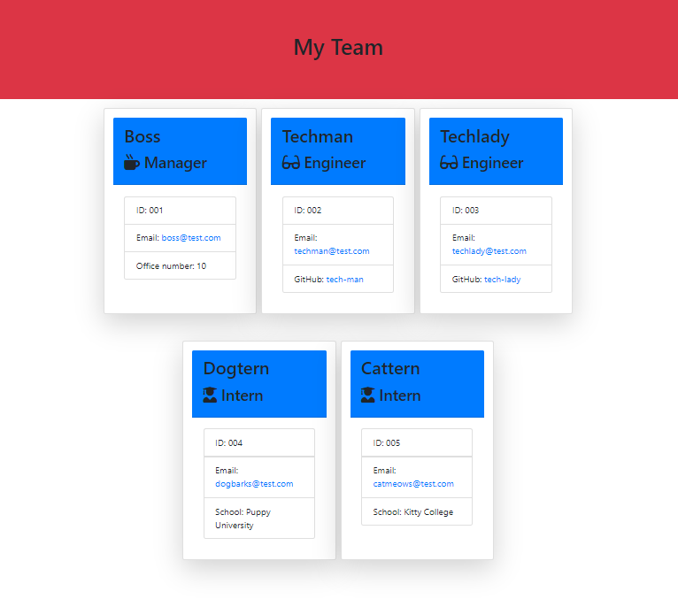

# Template_Engine-Employee_Summary



## Link

A video demonstration of how to use the application.

https://drive.google.com/file/d/1sWUFfq0IpVaYJGFWgRatr0M7apI3S9lo/view?usp=sharing

<br>

---

## Description

A command-line application using node.js and the inquirer package that allows a manager to dynamically generate a webpage that displays their team's basic info.

<br>

---

## Table of Contents

[Description](#description)

[Installation](#installation)

[Usage](#usage)

[Credits](#credits)

<br>

---

## Installation

1. Download node.js 

    * https://nodejs.org/en/

2. Open your terminal in the application file folder
    
    `./template_engine-employee_summary`

2. Install the node modules for the inquirer package
    ```
    npm install
    ```

<br>

---

## Usage

1. Start the application
    ```
    npm start
    ```
    or

    ```
    node app.js
    ```
2. Answer the series of question prompts to create your team

3. When you are done adding team members choose the `No more employees` option

    * `team.html` will be created and sent to the `output` folder

<br>

---

## Credits

Special thanks to Josh and the gang for their help!

https://emojipedia.org/